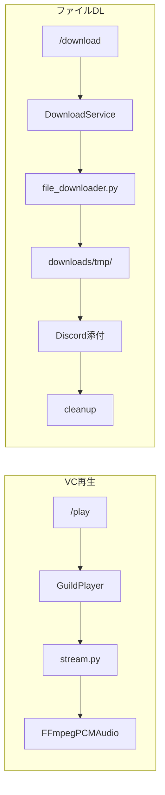

# Discord YouTube Downloader Bot

Discord 上で YouTube 動画のダウンロード（添付）と、ボイスチャンネルでの音楽再生ができるボットです。

## 機能

| 種類 | 内容 |
|------|------|
| VC 再生 | `/play` で **ストリーミング再生**（ディスクに保存しない） |
| ダウンロード | `/download` `/download_mp3` でファイル取得（Discord 25MB 制限内） |
| キュー | 複数曲の FIFO 再生、スキップ・ループ・一時停止 |
| 容量対策 | DL 前のサイズ見積もり、超過時は低画質の自動リトライ |
| 一時ファイル | `downloads/tmp/` に保存し、添付後に自動削除 |

## クイックスタート

```bash
git clone https://github.com/natuki53/YouTube_Downloader.git
cd YouTube_Downloader

# 仮想環境（macOS の Homebrew Python では必須）
python3 -m venv .venv
source .venv/bin/activate

python -m pip install -r requirements.txt
cp .env.example .env     # 初回のみ
# .env の DISCORD_TOKEN に Bot トークンを記入

python main.py   # venv 有効化後は python で OK
# または venv なし: python3 main.py
```

> macOS では `python` / `pip` が無いことがあります。`source .venv/bin/activate` 後に `python main.py` を使うか、常に `python3` を使ってください。

**起動は `main.py` のみです。** 旧ファイル（`bot_clean/`、`discord_bot_old.py`）は削除済みです。

## 必要環境

- Python 3.8+
- [FFmpeg](https://ffmpeg.org/)（VC 再生・MP3 変換に必須）
- [yt-dlp](https://github.com/yt-dlp/yt-dlp)（`requirements.txt` でインストール）
- Discord Bot トークン（[Developer Portal](https://discord.com/developers/applications)）

### FFmpeg

```bash
# macOS
brew install ffmpeg

# Ubuntu/Debian
sudo apt update && sudo apt install ffmpeg
```

## 設定（.env）

プロジェクトルートに `.env` を置きます（**Git にコミットしない**）。

```bash
cp .env.example .env
```

`.env` の例:

```env
DISCORD_TOKEN=あなたのBotトークン
BOT_PREFIX=!
DOWNLOAD_DIR=downloads
DOWNLOAD_TMP_DIR=downloads/tmp
MAX_FILE_SIZE=25
MAX_CONCURRENT_DOWNLOADS=2
TMP_MAX_AGE_MINUTES=30
DEFAULT_VOLUME=25
```

`DEFAULT_VOLUME` は VC 再生の初期音量（1〜100%）です。再生中は `/volume` で変更できます。

**優先順位:** デフォルト値 → `.env` → `config.py`（任意・上書き用）

既に `config.py` だけで運用している場合もそのまま動きますが、移行するならトークンを `.env` に移すのがおすすめです。

| 変数 | 説明 | デフォルト |
|------|------|-----------|
| `DISCORD_TOKEN` | Bot トークン | 必須 |
| `DOWNLOAD_TMP_DIR` | 一時 DL 先 | `downloads/tmp` |
| `MAX_FILE_SIZE` | 添付上限（MB） | `25` |
| `MAX_CONCURRENT_DOWNLOADS` | 同時 DL 上限 | `2` |

## コマンド一覧

### 音楽（VC）

| コマンド | 説明 |
|----------|------|
| `/play <URL or 曲名>` | URL または曲名検索でストリーム再生 |
| `/pause` `/resume` | 一時停止・再開 |
| `/skip` | 次の曲へ |
| `/stop` | 停止して VC から切断 |
| `/queue` | キュー表示 |
| `/clear` | キューのみクリア |
| `/loop` | 現在曲のループ切替 |
| `/volume [1-100]` | 音量の変更・確認 |

### ダウンロード

| コマンド | 説明 |
|----------|------|
| `/download <URL> <画質>` | 動画ファイル（mp4） |
| `/download_mp3 <URL>` | MP3 変換 |
| `/quality` | 画質一覧と 25MB のヒント |

### その他

| コマンド | 説明 |
|----------|------|
| `/help` | ヘルプ |
| `/ping` | 疎通確認 |

## アーキテクチャ



- **VC**: ギルドごとに `GuildPlayer` が 1 本の再生ループを持ち、yt-dlp で取得したストリーム URL をそのまま再生します。
- **DL**: `video_id` 固定の一時パスに保存 → サイズ確認 → 添付 → 削除。キャッシュはしません。

## プロジェクト構造

```
Youtube_Downloader_Bot/
├── main.py                 # エントリーポイント
├── .env                    # 設定（要作成・gitignore）
├── .env.example            # 設定テンプレ
├── config.py               # 任意の上書き用（gitignore）
├── setup.py
├── requirements.txt
├── downloads/
│   └── tmp/                # /download の一時ファイル
└── bot/
    ├── music/              # VC 再生コア
    ├── youtube/            # stream / file_downloader
    ├── commands/           # スラッシュコマンド
    ├── config/
    └── utils/
```

詳細は [DIRECTORY_STRUCTURE.txt](DIRECTORY_STRUCTURE.txt) を参照してください。

## トラブルシューティング

**FFmpeg がない**  
→ 上記の手順でインストールし、`ffmpeg -version` を確認。

**`davey library needed in order to use voice`**  
→ discord.py 2.7+ で VC に必須です。venv 内で再インストール:
```bash
source .venv/bin/activate
python -m pip install -r requirements.txt
```

**トークンエラー**  
→ `.env` の `DISCORD_TOKEN` を確認（余計な引用符・スペースなし）。Bot に `applications.commands` スコープで招待しているか確認。

**25MB を超える**  
→ `/download` は 480p 以下を推奨。長い動画は `/download_mp3`。ボットが自動で低画質・低 bitrate を試します。

**`/play` できない・すぐ止まる**  
→ yt-dlp を最新に: `pip install -U yt-dlp`。動画が地域制限・年齢制限の場合はスキップされます。

**tmp にファイルが残る**  
→ 起動時に 30 分以上古いファイルを自動削除。手動で `downloads/tmp/` を空にしても構いません。

## 注意事項

- YouTube の利用規約・著作権を遵守してください。
- 個人利用の範囲で使用してください。
- Discord のファイルサイズ上限（約 25MB）があります。

## ライセンス

MIT License

## 謝辞

- [yt-dlp](https://github.com/yt-dlp/yt-dlp)
- [discord.py](https://github.com/Rapptz/discord.py)
- [FFmpeg](https://ffmpeg.org/)

## 自宅サーバーへの自動デプロイ

`main` ブランチへの push を GitHub Webhook で受け取り、署名を検証してから
自宅サーバーのチェックアウトと Docker コンテナを更新できます。

サーバーでは `.env` をリポジトリ直下に配置し、初回のみ次を実行します。

```bash
docker compose up -d --build
```

Webhook 受信側へ `deploy/trigger.sh` を配置して実行してください。このスクリプトは
更新用コンテナを非同期で開始するため、Webhookへすぐ応答できます。実際の更新処理は
`deploy/deploy.sh` が担当し、次を行います。

- 同時デプロイをロックで防止
- `origin/main` 以外をデプロイしない
- コミット単位の Docker イメージを作成
- Discord へのログイン完了を確認
- 起動に失敗した場合は直前のイメージへロールバック

更新ログは `docker logs youtube-bot-deployer` で確認できます。

既存の [adnanh/webhook](https://github.com/adnanh/webhook) 受信コンテナへ
設定を追加する場合は、サーバーで次を実行します。

```bash
python3 deploy/install_webhook.py
docker restart deploy
```

GitHubには `https://<公開ホスト>/hooks/deploy-youtube-bot` をpushイベント用の
Webhookとして登録し、インストーラーが作成した秘密鍵を設定します。

## 公開ステータス用ハートビート

Docker Composeで起動すると、Botは10秒ごとに
`/home/natuki/services/runtime-status/youtube/status.json`へ公開監視用の
ハートビートを書き出します。初回起動前にホスト側のディレクトリをUID/GID
`1000:1000`、モード`0750`で作成してください。

出力にはBot ID、起動日時、更新日時、Discord接続状態、Gateway遅延だけを含め、
トークン、サーバー名、ユーザー、メッセージ、ログは含めません。別のホストパスを
使う場合はCompose実行時に`BOT_STATUS_HOST_DIR`を指定できます。
